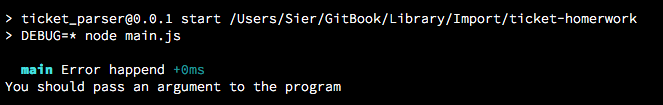

# Probando el programa

Una vez realizados los pasos citados en los capitulos 1.1, 1.2 y 1.2.1 (es decir, instalado node.js, npm, clonado el proyecto e instalado depenendencias con `npm install`) bastara con probar el programa, esto se hara posicionando una terminal en la carpeta del proyecto principal y escribiendo:

`npm start` 

El programa tratar de iniciar y debera mostrar un error similar al siguiente:

