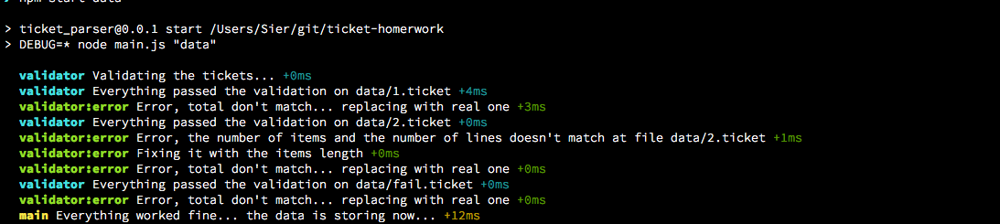
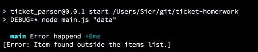

# Mensajes

Durante una ejecución normal se podran apreciar estos mensajes:

Los mensajes vienen en el formato:

`modulo:detalle <mensaje> +tiempo`

Con esto se puede apreciar, que el modulo `validator` ha encontrado errores en nuestros archivos y nos avisa que por este motivo, hara una adaptación de los datos.

Cuando algo falla, nos encontraremos con mensajes encerrados:

`[Error: Algun error]`

